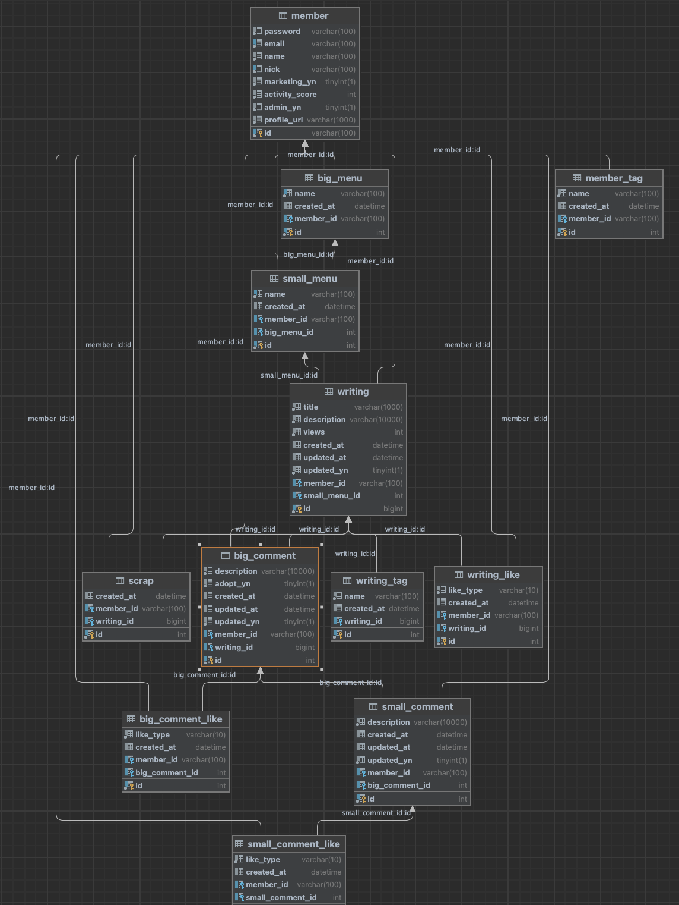

# OKKY DB 요구사항

## ERD

[회원]
- [X] (식별자)를 가진다.
- [X] (암호)를 가진다.
- [X] (이메일)을 가진다.
- [X] (실명)을 가진다.
- [x] (닉네임)을 가진다.
- [x] (마케팅 동의여부)를 가진다.
- [x] (활동점수)를 가진다.
- [x] (관리자 여부)를 가진다.
- [x] (프로필 주소)를 가진다.
- [x] (식별자)로 구별한다.
- [x] (아이디, 이메일, 닉네임)은 고유하다.

[대메뉴]
- [x] (식별자)를 가진다.
- [x] (이름)을 가진다.
- [x] (생성시간)을 가진다.
- [x] (유저-식별자)를 가진다.
- [x] [유저]에 속한다.
- [x] (식별자)로 구별한다.
- [x] (식별자, 이름)은 고유하다.

  [소메뉴]
- [x] (식별자)를 가진다.
- [x] (이름)을 가진다.
- [x] (생성시간)을 가진다.
- [x] (유저-식별자)를 가진다.
- [x] (대메뉴-식별자)를 가진다.
- [x] [유저]에 속한다.
- [x] [대메뉴]에 속한다.
- [x] (식별자)로 구별한다.
- [x] (식별자, 이름)은 고유하다.

[글]
- [x] (식별자)를 가진다.
- [x] (제목)을 가진다.
- [x] (내용)을 가진다.
- [x] (조회수)를 가진다.
- [x] (생성시간)을 가진다.
- [x] (수정시간)을 가진다.
- [x] (수정여부)를 가진다.
- [x] (유저-식별자)를 가진다.
- [x] (소메뉴-식별자)를 가진다.
- [x] [유저]에 속한다.
- [x] [소메뉴]에 속한다.
- [x] (식별자)로 구별한다.
- [x] (식별자)은 고유하다.

[댓글]
- [x] (식별자)를 가진다.
- [x] (내용)을 가진다.
- [x] (채택여부)를 가진다.
- [x] (생성시간)을 가진다.
- [x] (수정시간)을 가진다.
- [x] (수정여부)를 가진다.
- [x] (유저-식별자)를 가진다.
- [x] (글-식별자)를 가진다.
- [x] [유저]에 속한다.
- [x] [글]에 속한다.
- [x] (식별자)로 구별한다.
- [x] (식별자)은 고유하다.

[대댓글]
- [x] (식별자)를 가진다.
- [x] (내용)을 가진다.
- [x] (생성시간)을 가진다.
- [x] (수정시간)을 가진다.
- [x] (수정여부)를 가진다.
- [x] (유저-식별자)를 가진다.
- [x] (댓글-식별자)를 가진다.
- [x] [유저]에 속한다.
- [x] [댓글]에 속한다.
- [x] (식별자)로 구별한다.
- [x] (식별자)은 고유하다.

[글 추천]
- [x] (식별자)를 가진다.
- [x] (추천 타입)을 가진다.
- [x] (생성시간)을 가진다.
- [x] (유저-식별자)를 가진다.
- [x] (글-식별자)를 가진다.
- [x] [유저]에 속한다.
- [x] [글]에 속한다.
- [x] (식별자)로 구별한다.
- [x] (식별자)은 고유하다.

[댓글 추천]
- [x] (식별자)를 가진다.
- [x] (추천 타입)을 가진다.
- [x] (생성시간)을 가진다.
- [x] (유저-식별자)를 가진다.
- [x] (댓글-식별자)를 가진다.
- [x] [유저]에 속한다.
- [x] [댓글]에 속한다.
- [x] (식별자)로 구별한다.
- [x] (식별자)은 고유하다.

[대댓글 추천]
- [x] (식별자)를 가진다.
- [x] (추천 타입)을 가진다.
- [x] (생성시간)을 가진다.
- [x] (유저-식별자)를 가진다.
- [x] (대댓글-식별자)를 가진다.
- [x] [유저]에 속한다.
- [x] [대댓글]에 속한다.
- [x] (식별자)로 구별한다.
- [x] (식별자)은 고유하다.

[회원 태그]
- [x] (식별자)를 가진다.
- [x] (이름)을 가진다.
- [x] (생성시간)을 가진다.
- [x] (유저-식별자)를 가진다.
- [x] [유저]에 속한다.
- [x] (식별자)로 구별한다.
- [x] (식별자, 이름)은 고유하다.

[글 태그]
- [x] (식별자)를 가진다.
- [x] (이름)을 가진다.
- [x] (생성시간)을 가진다.
- [x] (글-식별자)를 가진다.
- [x] [글]에 속한다.
- [x] (식별자)로 구별한다.
- [x] (식별자, 이름)은 고유하다.

[스크랩]
- [x] (식별자)를 가진다.
- [x] (생성시간)을 가진다.
- [x] (유저-식별자)를 가진다.
- [x] (글-식별자)를 가진다.
- [x] [유저]에 속한다.
- [x] [글]에 속한다.
- [x] (식별자)로 구별한다.
- [x] (식별자)은 고유하다.